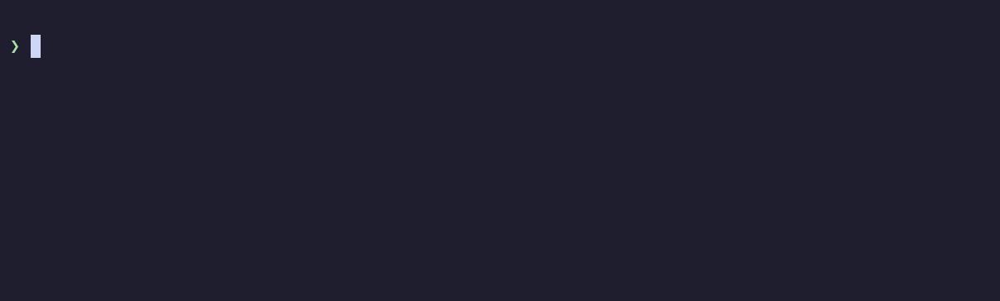

# deja

Opens the past Claude Code session you talked about.



```
deja cake recipe      # one session — opened; several — an fzf list, newest first
deja                  # the 30 most recent sessions
deja -l query         # print only
deja --wrong          # the last jump opened the wrong session
deja --stats          # summary of failed searches
deja --reindex        # rebuild the index
```

The index is SQLite FTS5 (`tokenize='trigram'`) over the messages you wrote in
`~/.claude/projects`, kept in `~/.cache/deja`. It refreshes itself by mtime:
4 s for a full build, 0.1 s for a normal run. When the schema changes, the index is rebuilt.

Search is lexical. A word is shortened to a prefix the corpus actually contains
(`results` → `result`), then words that never appear alongside the rest are dropped.
This is why a synonym finds nothing: `mutation testing` will not reach a session that says
`stryker`.

Every run appends its outcome to `~/.cache/deja/picks.jsonl`, and `deja --stats` turns that
into a failure rate. An automatic jump that opened the wrong session looks like a success in
the log — only you can tell it apart, with `deja --wrong`.

No runtime dependencies: Node 24 (`node:sqlite`, native TypeScript) and `fzf` for the list.

```
pnpm install && pnpm link --global
pnpm check
```

The recording above runs against a synthetic home built by `scripts/seed-demo.mjs`, so no real
session appears in it. Rebuild it with `demo/make.sh` (needs `agg` and `python3`).
